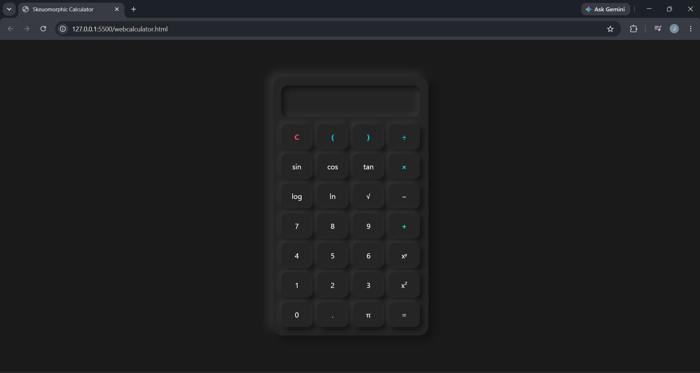
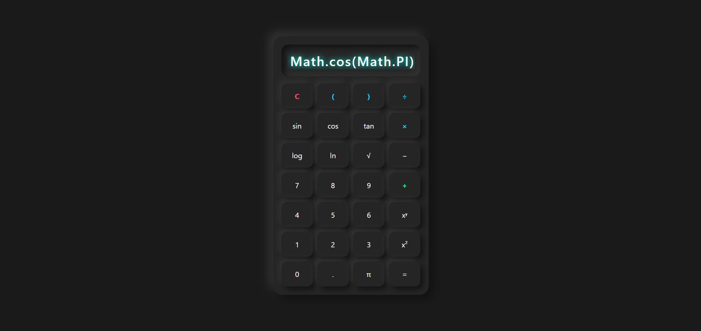
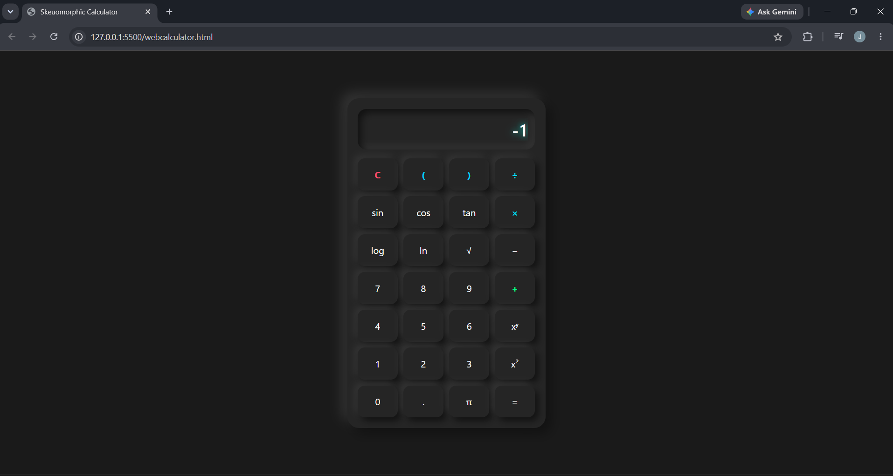

# Scientific Calculator

A modern, responsive, and feature-rich Scientific Calculator built using HTML, CSS, and JavaScript. This project combines a sleek dark-themed user interface with powerful scientific functions and keyboard accessibility, providing a smooth and intuitive user experience.

---

## Overview

The Scientific Calculator is a web-based application designed to perform both basic arithmetic and advanced scientific calculations. The interface is optimized for desktop and mobile devices, featuring responsive layouts, interactive button animations, and keyboard controls for faster operation.

---

## Features

### Basic Arithmetic Operations

* Addition (+)
* Subtraction (-)
* Multiplication (×)
* Division (÷)
* Decimal calculations

### Scientific Functions

* Sine (sin)
* Cosine (cos)
* Tangent (tan)
* Logarithm (log)
* Natural Logarithm (ln)
* Square Root (√)
* Power Calculations
* Pi (π)

### User Interface

* Modern dark-themed design
* Responsive layout for desktop and mobile devices
* Interactive button hover and press effects
* Clear and readable calculator display
* Scientific calculator layout

### Keyboard Support

* Number keys (0–9)
* Arithmetic operators
* Enter key for calculations
* Backspace key for deleting characters
* Escape key for clearing the display
* Shortcut keys for scientific functions

---

## Technologies Used

* HTML5
* CSS3
* JavaScript (ES6)

---

## Screenshots

### Calculator Interface



### Scientific Functions



### Keyboard Support



---

## Project Structure

```text
Scientific-Calculator/
│
├── index.html
├── style.css
├── script.js
├── README.md
└── screenshots/
    ├── calculator-home.png
    ├── scientific-mode.png
    └── keyboard-support.png
```

---

## Installation and Usage

### Method 1: Direct Execution

1. Download or clone the repository.
2. Open the project folder.
3. Open `index.html` in any modern web browser.

### Method 2: Using Visual Studio Code

1. Open the project folder in VS Code.
2. Install the Live Server extension.
3. Right-click on `index.html`.
4. Select **Open with Live Server**.

---

## Keyboard Shortcuts

| Key       | Function              |
| --------- | --------------------- |
| 0–9       | Numbers               |
| +         | Addition              |
| -         | Subtraction           |
| *         | Multiplication        |
| /         | Division              |
| Enter     | Calculate             |
| Backspace | Delete Last Character |
| Esc       | Clear Display         |
| S         | Sine Function         |
| C         | Cosine Function       |
| T         | Tangent Function      |
| L         | Logarithm             |
| N         | Natural Logarithm     |
| R         | Square Root           |
| P         | Pi Constant           |

---

## Future Enhancements

* Calculation history panel
* Memory functions (M+, M-, MR, MC)
* Percentage calculations
* Theme switching options
* Degree/Radian mode selection
* Advanced mathematical operations

---

## Learning Outcomes

Through this project, the following concepts were implemented and practiced:

* Responsive Web Design
* CSS Grid Layout
* JavaScript DOM Manipulation
* Event Handling
* Keyboard Event Listeners
* Mathematical Function Integration
* UI/UX Design Principles

---

## Author

**VENKATA JAYADEEP MADDIPATLA**

B.Tech Computer Science and Engineering

SRM Institute of Science and Technology (SRMIST), Kattankulathur

---

### Project Status

✅ Completed

🚀 Ready for deployment and further enhancements.
